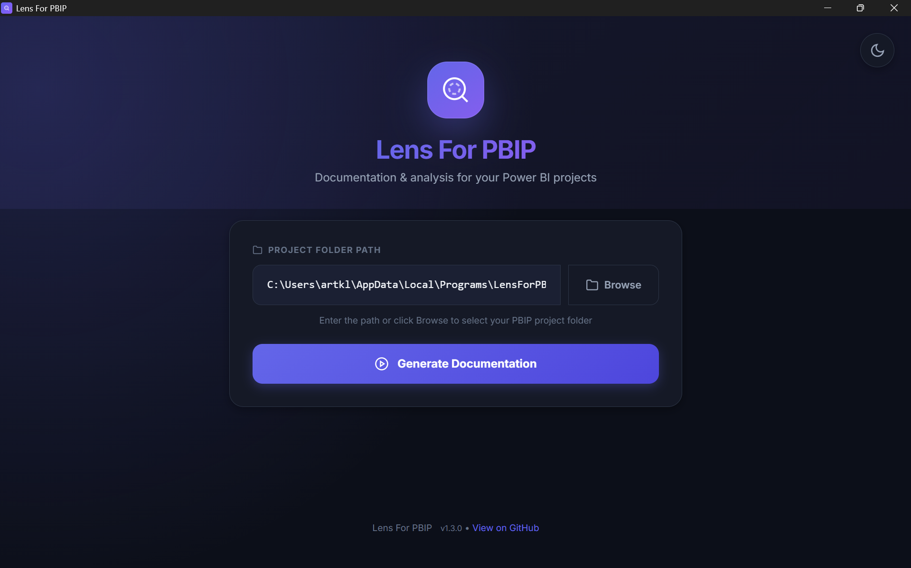
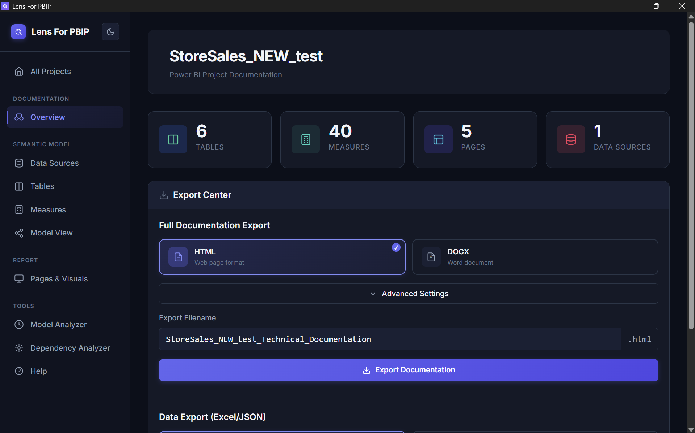
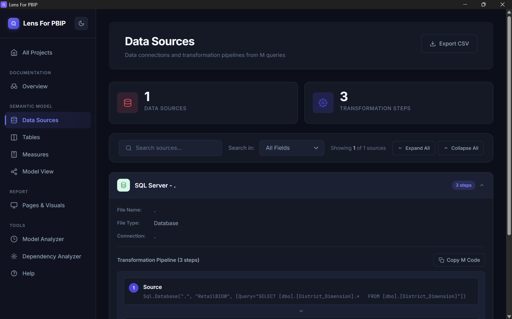
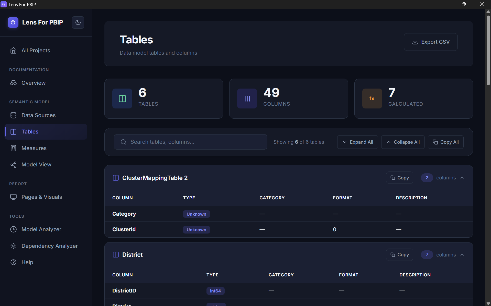
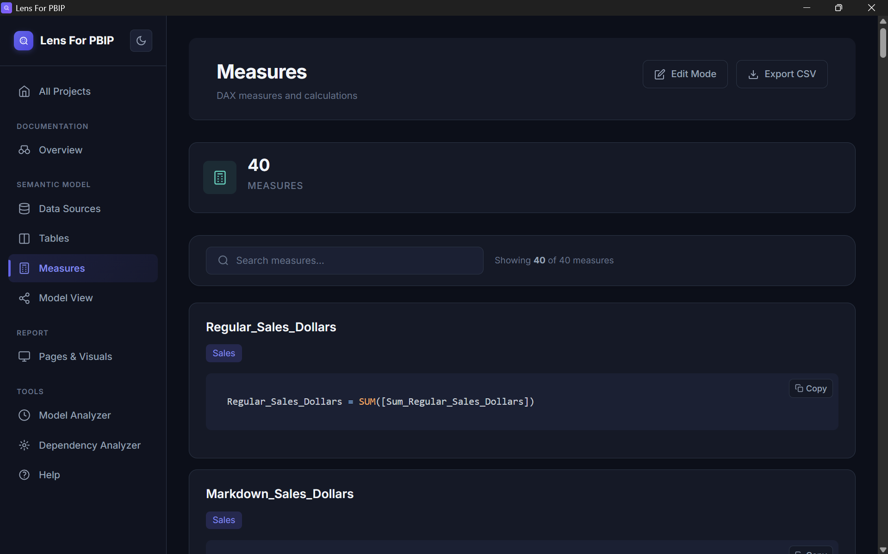
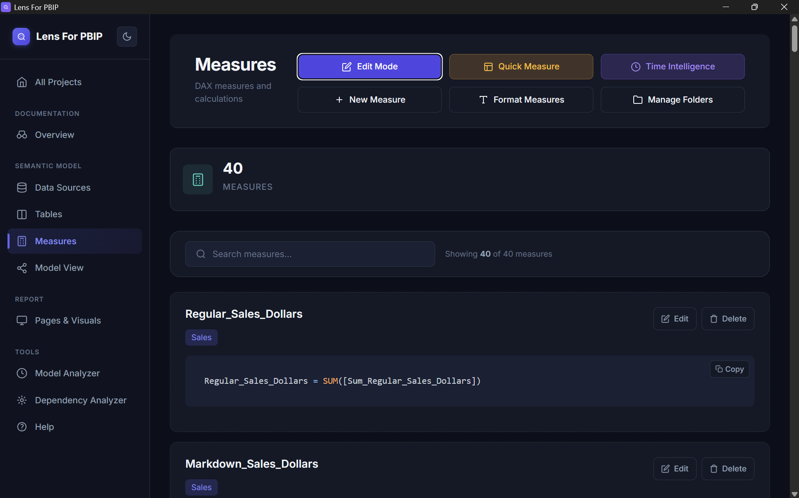
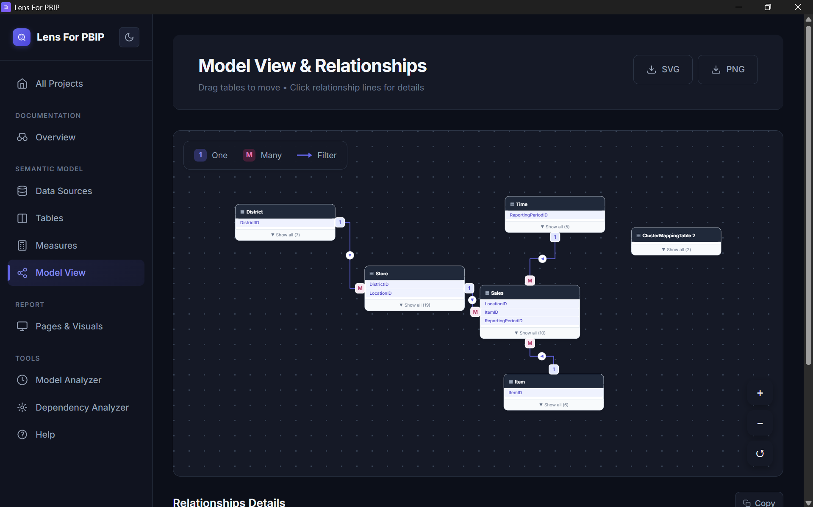
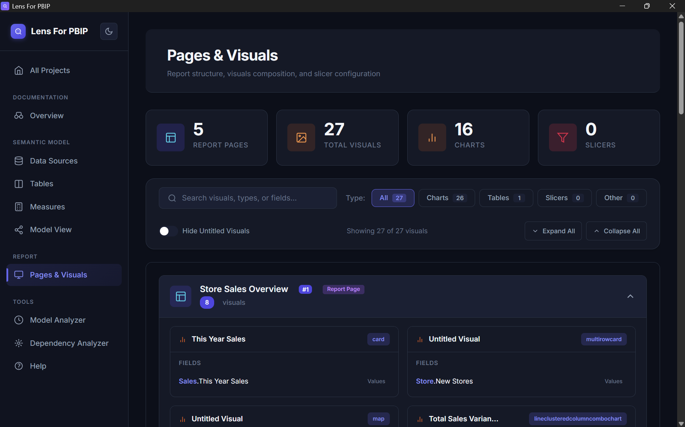
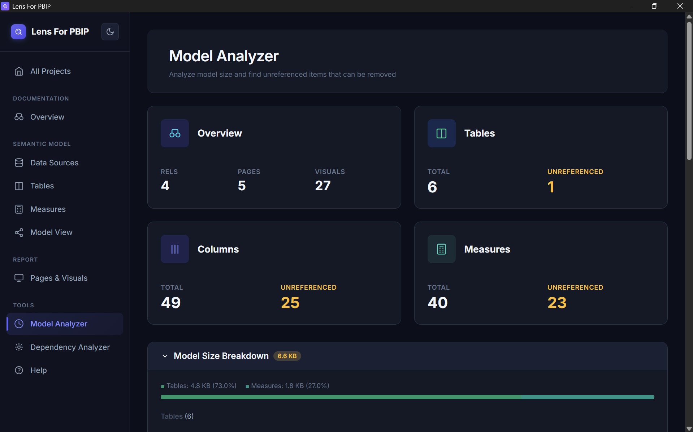
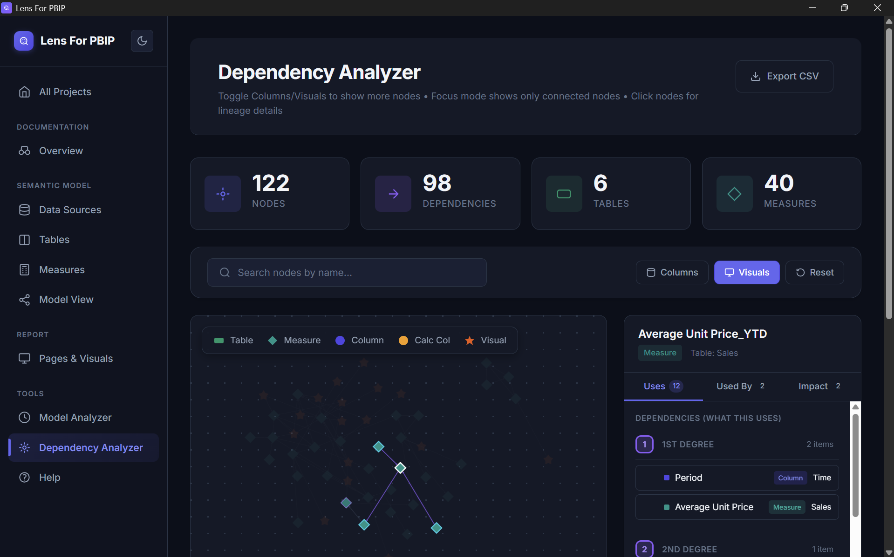

# LensForPBIP 🔍

**Document, analyze, visualize, and edit Power BI Projects—all in one tool.**

Microsoft's move to the PBIP (Power BI Project) format is a massive leap forward for version control. However, reviewing changes or auditing complex models by looking at raw `.tmdl` or `.json` files is tedious and prone to error. More than that, creating comprehensive documentation of your entire data model, analyzing dependencies, and visualizing relationships typically requires significant manual effort or custom scripts.

**LensForPBIP solves this.** With one click, it parses your local PBIP folder and generates complete documentation of your data model, DAX measures, and report relationships. Analyze, visualize, and export your model—all through a clean, navigable interface with no code required. It's a standalone utility built to make the lives of BI developers easier.

---

## 📑 Table of Contents

- [Preview](#️-preview)
- [Features](#-features)
- [Download & Install](#-download--install)
- [Windows SmartScreen](#️-a-note-on-windows-smartscreen)
- [Quick Start](#-quick-start)
- [License & Usage](#️-license--usage)

---

## 🖼️ Preview

### Landing Page
Select your PBIP project folder and get instant documentation.

---

### Documentation
#### Overview
Get a bird's-eye view of your project with key statistics and an Export Center.

---

### Semantic Model
#### Data Sources
View data source connections, M code, and transformation pipelines.

#### Tables
Browse table schemas with column properties and data types.

#### Measures
Inspect DAX expressions, folder organization, and copy-to-clipboard.

#### Measures (Edit Mode)
Create, edit, and delete measures directly. Includes Quick Measures Library and Time Intelligence Wizard.

#### Model View
Visualize your data model relationships with an interactive, draggable diagram.

---

### Report
#### Pages & Visuals
Audit page hierarchy, visual types, and field mappings.

---

### Tools
#### Model Analyzer
Find unused tables, columns, and measures that may be bloating your model.

#### Dependency Analyzer
Visualize measure and column dependencies as an interactive graph. Trace DAX lineage and identify circular references.

---

## ✨ Features

### 📊 Semantic Model Documentation
| Feature | Description |
|---------|-------------|
| **Data Sources** | View data source connections, M code, and transformation pipelines |
| **Tables & Columns** | Browse table schemas with column properties and data types |
| **Measures** | Inspect DAX expressions with syntax highlighting & quick copy |
| **Model View** | Interactive relationship diagram with drag, zoom, and export |

### 📄 Report Analysis
| Feature | Description |
|---------|-------------|
| **Pages & Visuals** | Audit page hierarchy, visual types, and field mappings |
| **Visual Filters** | See which filters are applied to each visual |

### 🛠️ Developer Tools
| Feature | Description |
|---------|-------------|
| **Model Analyzer** | Identify unreferenced tables, columns, and measures |
| **Dependency Analyzer** | Interactive DAX lineage graph with circular reference detection |
| **Edit Mode** | Create, edit, and delete measures directly from the UI |
| **Quick Measures Library** | Pre-built measure templates (YoY, Running Total, etc.) |
| **Time Intelligence Wizard** | Generate common time intelligence calculations |
| **Display Folder Manager** | Organize measures into nested display folders |

### 📥 Export Options
- **Full Documentation**: Export as HTML or DOCX with customizable sections
- **Data Export**: Export to Excel (.xlsx) or JSON with selectable components
- **Model View Snapshot**: Export the relationship diagram as SVG or PNG

---

## 📥 Download & Install

### 1. Get the Installer
Download the latest `LensForPBIP_Setup.exe` from the [**Releases Page**](https://github.com/artklas/LensForPBIP/releases).

### 2. Run the Setup
Run the executable and follow the standard installation prompts.

---

## 🛡️ A Note on Windows SmartScreen

When you run the installer, you will likely see a blue window saying **"Windows protected your PC."**

**Why is this happening?**  
This is a standard Windows security feature for software that hasn't purchased an expensive "Code Signing Certificate." As a developer releasing this as a free hobby project, I haven't purchased a certificate yet.

**How to proceed:**
1. Click **"More info"**
2. Click **"Run anyway"**

If you are concerned about security, feel free to run the executable in a sandbox or VM first.

---

## 🚀 Quick Start

1. **Launch** LensForPBIP
2. **Click "Browse"** or paste the path to your `.pbip` project folder
3. **Click "Generate Documentation"** to load your project
4. **Navigate** through the sidebar to inspect your Model, Measures, and Reports
5. **(Optional)** Export the documentation for your records

---

## ⚖️ License & Usage

**LensForPBIP is Freeware.**

I built this tool to help with my own Power BI workflows and decided to share it with the community.

| ✅ Allowed | ❌ Prohibited |
|-----------|--------------|
| Personal use | Redistribution |
| Educational use | Modification |
| Commercial business purposes | Reverse engineering |
| | Selling this software |

For the full legal details, please read the [EULA](LICENSE.txt).

---

  <strong>Copyright © 2026 Lens For PBIP. All Rights Reserved.</strong>

  <a href="https://github.com/artklas/LensForPBIP">View on GitHub</a> •
  <a href="https://github.com/artklas/LensForPBIP/releases">Download Latest Release</a>

